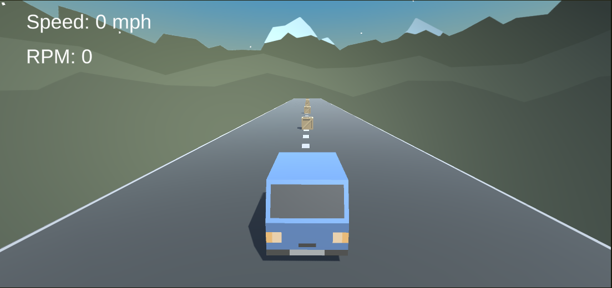
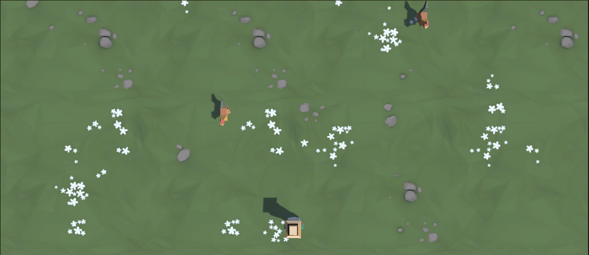
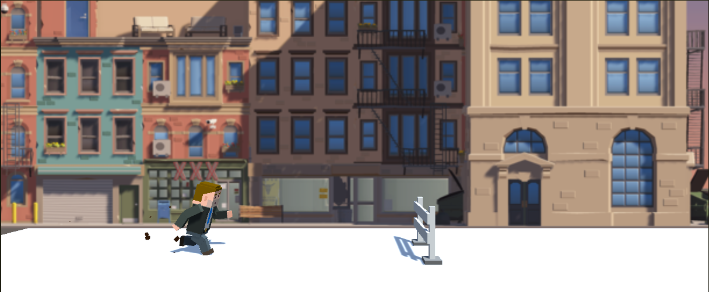
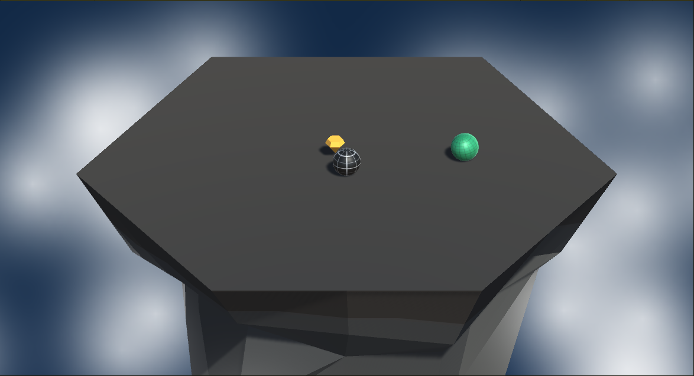
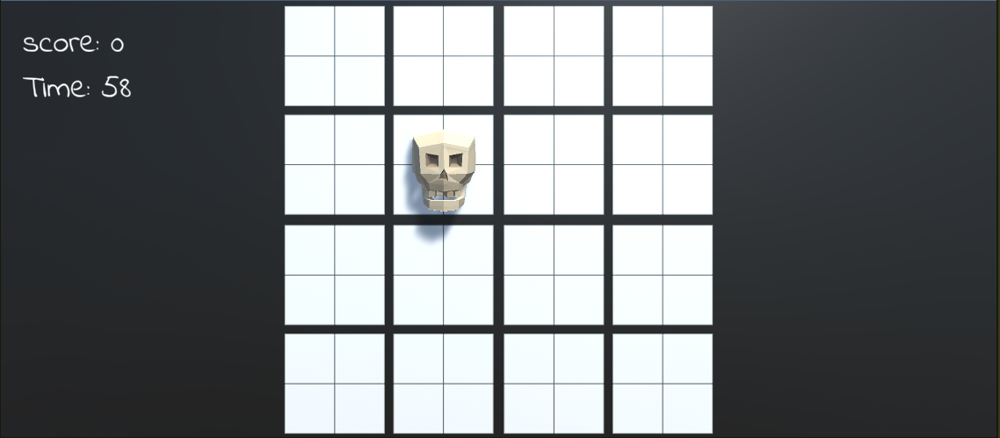

# Unity Junior Pathway
Projects that I developed during the Unity Junior Pathway

<h3> Prototype 1 <h3>
  This is prototype is for understanding basic car controls and movements.
  

  
\

  
<h3> Prototype 2 <h3>
  This is prototype is a top down game. We are try to feed the animals coming towards us from the top of the screen. Our character can move left and right with A and D key. He throw food with space bar.
  

  
  
\

  
<h3> Prototype 3 <h3>
  This is prototype is a endless runner game. We try to jump over obstacles. If we hit one of the obstacle we die and lose the game. Character jump with space bar.
  
  
  
\

  
<h3> Prototype 4 <h3>
  This purpose of this game is collect diamond without falling off the platform. Other enemy balls try to throw us off the platform. We can hit the enemy balls and throw them off the platform. Our ball moves with W and S key. Direction of movement depends of camera look direction. We can change camera look direction with A and D key. Also we can collects power up and we can increase our collision power.
  

  
  
  
\

  
<h3> Prototype 5 <h3>
  In this we try to click good food and avoid to click skeleton. We have certain time and we try to get points as much as possible. If we click to one of the skeleton or miss one of the food we lose. We click objects with left key of mouse.
  

